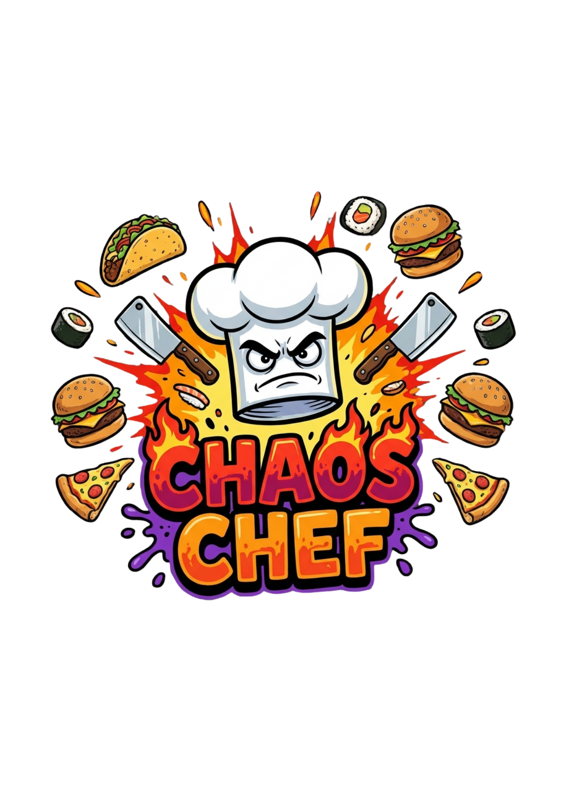

# Chaos Chef 🍳



🎮 **[Oyunu Oyna - itch.io](https://truyak.itch.io/chaos-chef)**

Restoran temalı bir kart savaş oyunu! Garson olarak sinirli müşterilere karşı savunma yapın!

## 🎮 Oyun Hakkında

**Chaos Chef**, 2D kart tabanlı bir sıra tabanlı strateji oyunudur. Oyuncu bir garson rolünde, restorana gelen zorlu müşterilere karşı yemek temalı kartlarla savaşır.

### Oynanış
- **Kart Oynama**: Her turda stamina harcayarak kart oynayın
- **Stamina Yönetimi**: Her kart farklı stamina maliyetine sahip
- **Özel Efektler**: Stun, Poison, Debuff gibi efektlerle avantaj kazanın
- **Level Sistemi**: Müşterileri yenerek yeni seviyelere geçin
- **Kart Koleksiyonu**: Coin kazanarak yeni kartlar açın ve destenizi oluşturun

## 🤖 Yapay Zeka Sistemi

Bu oyun **Q-Learning** tabanlı bir yapay zeka içerir. Müşteri (düşman) karakteri, takviyeli öğrenme algoritmasıyla eğitilmiş bir ajan tarafından kontrol edilir.

### Q-Learning Nedir?
- **State (Durum)**: Oyunun anlık durumu (HP, efektler, vb.)
- **Action (Aksiyon)**: Yapılabilecek hareketler (8 farklı saldırı)
- **Reward (Ödül)**: Aksiyonun sonucuna göre puan
- **Q-Table**: Her durum-aksiyon çifti için öğrenilen değerler

### Yapay Zeka Yükleme
Ana menüdeki toggle ile AI modunu değiştirebilirsiniz:
- **AI: Smart** - Eğitilmiş Q-Table yüklenir, AI akıllı kararlar verir
- **AI: Random** - Q-Table boş, AI rastgele hareket eder

## 📁 Proje Yapısı

```
Chaos-Chef/
├── CustomerAI_Model.json     # Eğitilmiş AI ağırlıkları (Q-Table)
├── chaos_chef_logo.png       # Oyun logosu
├── Assets/_Game/
│   ├── Scripts/
│   │   ├── AI/               # AI implementasyonu
│   │   │   ├── CustomerAI.cs     # Q-Learning algoritması
│   │   │   ├── AITrainer.cs      # Eğitim sistemi
│   │   │   └── TrainingPlayer.cs # Simülasyon oyuncusu
│   │   ├── GameManager.cs    # Ana oyun döngüsü
│   │   └── ActionProjectile.cs   # Saldırı görselleri
│   ├── Resources/AI/         # Build için gömülü model
│   └── Sprites/Projectiles/  # Saldırı ikonları
└── Builds/                   # Oyun build'leri
```

## 🔧 Kontroller

- **Kartlara tıklayın** - Kart oynamak için
- **Turu Bitir** - Sıranızı bitirmek için
- **AI Toggle** - Ana menüde AI modunu değiştirmek için
